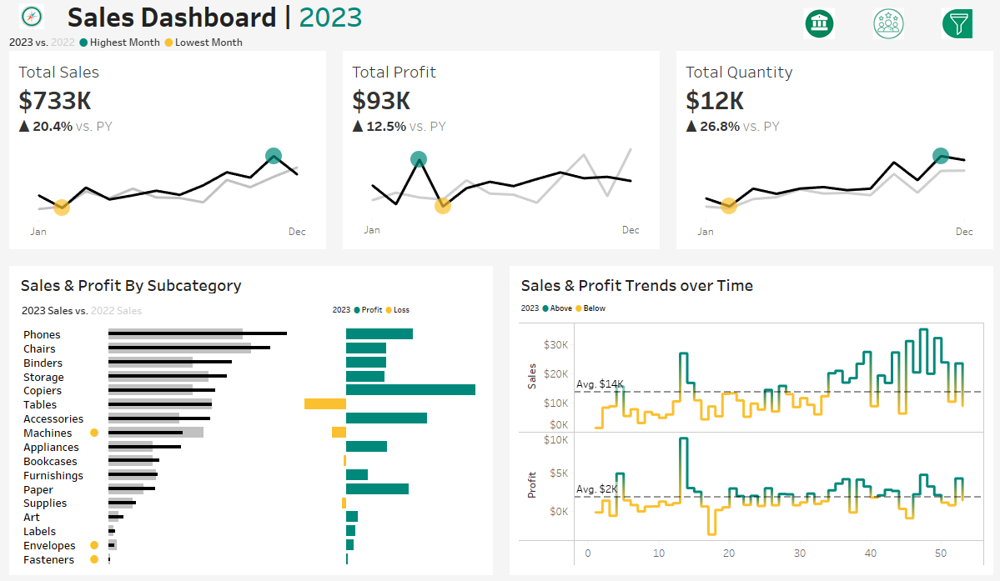
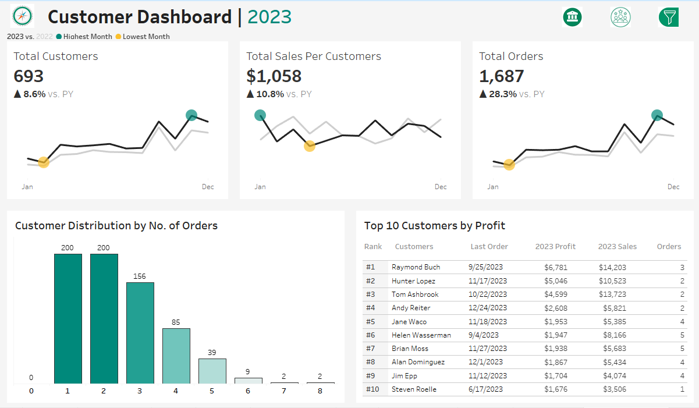

# 📊 Sales & Customer Analytics Dashboard  
### Interactive Business Intelligence Project using Tableau

---

## 🚀 Project Overview

This project presents an interactive **Sales & Customer Analytics Dashboard** built using **Tableau Desktop**.  
The dashboard transforms raw transactional data into meaningful business insights by analyzing revenue, profitability, sales volume, and geographic performance.

It enables dynamic exploration through filters and parameters, allowing users to make data-driven decisions.

---

## 📸 Dashboard Preview

### 🔹 Sales Dashboard

### 🔹 Customer Dashboard

---

## 🎯 Business Objective

The goal of this project is to:

- Track overall sales performance
- Monitor profitability trends
- Identify high-performing products
- Analyze regional sales distribution
- Enable year-based performance comparison

This dashboard centralizes key metrics into a single interactive view for better business decision-making.

---

## 📌 Key Performance Indicators (KPIs)

- **Total Sales** → Overall revenue generated  
- **Total Profit** → Net earnings after costs  
- **Total Quantity** → Total number of units sold  

These KPIs provide a high-level snapshot of business performance.

---

## 🔎 Dashboard Features

### 🎛 Interactive Filters
- **Product Filter** – Analyze performance by product/category  
- **Location Filter** – Explore regional and state-level insights  
- **Select Year (Parameter)** – Dynamically switch between years  

### 📊 Visual Analysis Includes
- Sales & Profit Trend Over Time  
- Product Performance Comparison  
- Geographic Sales Distribution  
- KPI Summary Cards  

---

## 🗂 Data Sources

This dashboard integrates multiple datasets:

- `Orders.csv` – Transaction-level sales data  
- `Customers.csv` – Customer information  
- `Products.csv` – Product details and categories  
- `Location.csv` – Geographic data  

### 🔗 Data Relationships

- Orders ↔ Customers via **Customer ID**  
- Orders ↔ Products via **Product ID**  
- Orders ↔ Location via **Geographic fields**  

This relational structure enables multi-dimensional analysis across customers, products, and regions.

---

## 🛠 Technical Skills Demonstrated

- Tableau Dashboard Design  
- Data Modeling (Relationships / Joins)  
- KPI Card Creation  
- Parameter Controls  
- Interactive Filters  
- Time Series Analysis  
- Multi-table Data Integration  

---

## 📈 Insights Enabled

Using this dashboard, stakeholders can:

- Identify top-performing products  
- Detect high-profit regions  
- Compare yearly performance  
- Monitor sales growth patterns  
- Evaluate profitability trends  

---

